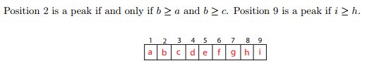
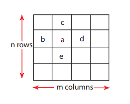
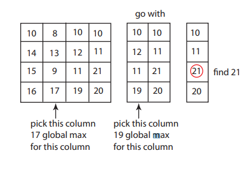

# Peak Finding
A value is considered a peak, if it is larger than its *immediate* neighbours.

## 1d Version
Value at `array[i]` is a peak **iff** `array[i] >= array[i-1] and array[i[] >= array[i+1]`:

A peak **always exists** as the definition uses *>=* .

### Solution
Binary search divide and conquer method:
* Look at *n/2* position
* If `array[n/2] > array[n/2 -1]`:
    * Look at **left half** `1...n/2 --- 1` to look for peak
* Else if `array[n/2] < array[n/2 +1]`:
    * Look at **right half** `n/2 +1 ... n` to look for peak
* Else `array[n/2]` is a peak:
    * `array[n/2] >= array[n/2-1]`
    * `array[n/2] >= array[n/2+1]`

### Complexity
*T(n)* = work algorithm does on input size *n*.
* Comparing `array[n/2]` to neighbours = &Theta;(1)
* Base Case :
    * **T(1) = &Theta;(1)**
    * One element array -> return element as peak.

*T(n) = T(n/2) + &Theta;(1)*

*=&Theta;(1) + ... &Theta;(1)(log2(n)times)*

***= &Theta;(log2(n))***

## 2d Version

*a* is a peak **iff**:
* *a >= b, a >= c, a >= d, a >= e*

### Solution
1. Pick middle column *j = m/2*
2. Find *global maximum* on column *j* at *(i, j)*
    * Linear search for maximum element
3. Compare *(i, j-1), (i,j), (i, j+1)*
4. Pick columns to continue with:
    * Left half if *(i, j-1) > (i, j)*
    * Right half if *(i, j+1) > (i, j)*
5. *(i, j)* is a 2D peak if **neither** condition from step 4 holds.
* *(i, j)* is known to be maximum in *j* direction
* If neither *(i, j-1) or (i, j+1)* are > than *(i, j)* then it must **also be a peak** in the *i* direction -> 2D peak.
6. Solve new problem with 1/2 number of columns
* When a single column left, find global maximum -> done.

### Complexity
*T(n, m)* = work required for problem with *n* rows and *j* cols.

Finding **global maximum** in single column = &Theta;(n).
    * Linear search through array

*T(n, m) = T(n, m/2)+&Theta;(n)*

*=&Theta;(n)+...+&Theta(n)*((log2(m) times)
***= &Theta;(nlogm)** = &Theta;(nlogn)* if *m == n*