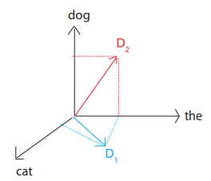

# Document Distance Problem
Given two documents *d1*, *d2* compute the **distance** between them.
* Distance = how **different** the documents are
* Document = sequence of words
* Word = string of alphanumeric chars

## Shard words/chars
* Represent document as a **vector**
    * D1 = "the cat", D2 = "the dog":
    * 

* D[w] = # occurrences of w in D
* Use **angle between the vectors**:
    * arccos(D1&middot;D2 / |D1||D2|)
        * Dot products divided by lengths of documents to make more scale invariant
### Algorithm
1. Split document into words
    * word = sequence of consectutive alphanumeric characters (punctuation acts
    like a space)
    * Case insensitive
2. Compute word frequencies (vectors for each document)
3. Compute angle between vectors:
    * d(x,y) = arccos(inner_product(x,y) / (norm(x)*norm(y)))
        * where:
            * inner_product(x,y) = x1*y1 + x2*y2 + ... xn*yn
            * norm(x) = sqrt(inner_product(x,x))

### Implementation

1. Read file by lines:
    * Change punctuation to spaces
    * Lowercase
    * Split
2. Add each word in line to python `collections.Counter`
3. Repeat for second file
4. Inner Product:
    * iterate over key:val pairs, if key in both vectors, multiple vals together and add to total.
5. Calculate angle using inner product
