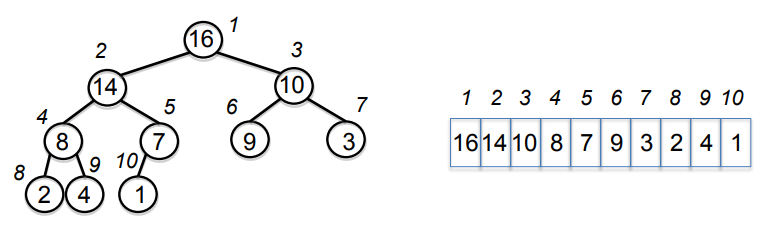

# Heaps and Heap Sort

## Motivation: Priority Queue
* Implements a set *S* of elements, each associated with a key.
* Key represents the priority of the element
* Operations:
    * insert(S, x): insert element *x* into *S*
    * max(S): return element of *S* with largest key
    * extract_max(S): return element of *S* with largest key **and remove** it from *S* (Pop)
    * increase_key(S,x,k): increase the value of element *x*'s key to new value *k*
        * Could also implement a decrease_key(S,x,k) (or update_key)

## Heap
* Priority queue implementation
* An array visualized as a *nearly complete* binary tree
    * Nearly complete as array may not have even number of items

TODO: Write diagram in ASCII :D



### Heap as a Tree
* Root of tree: first element in array (i=1)
* parent(i) = i/2: index of node parent
* left(i) = 2i: index of node left child
* right(i) = 2i+1: index of node right child
* Height - O(logn)

* Max-Heap has **Max-Heap Property**: The key of a node is >= the keys of its children
    * Must be true for every node in the tree (except leaves as no children)
* Min-Heap **Min-Heap Property**: The key of a node is <= the keys of its children
    * Must be true for every node in the tree (except leaves as no children)

* max(S) is trivial on max-heap
    * Doesn't modify the heap -> max-heap property is maintained with no work
* `extract_max` is not trivially performed on max-heap
    * Heap is modified -> work must be done to ensure max-heap property maintained
        * Want to still have a max-heap after extract_max performed
* vice-versa for min-heap

### Heap Operations
* build_max_heap: produce a max-heap from an **unordered array**
* max_heapify: Correct a **single violation** of the heap property in a **subtree's root**
    * Fundamental operation for building max-heaps

#### Max_Heapify
* Assume that the trees rooted at left(i) and right(i) are max-heaps
* If element A[i] violates max-heap property:
    * Correct by 'trickling' A[i] down the tree
        * Making subtree rooted at index i a max-heap
```
Max_heapify(A, i):
    l = left(i)
    r = right(i)
    if l<=heap_size(A) and A[l] > A[i]:
        then largest = l
    else:
        largest = i
    if r <= heap_size(A) and A[r] > A[largest]:
        then largest = r
    if largest != i:
        then exchange A[i] and A[largest]:
            Max_Heapify(A, largest)
```

* **O(logn)** complexity
    * Height of binary tree = O(logn)
    * Assumption of only 1 violation means constant operations per level

#### Build_Max_Heap
* Convert and unordered array A[1...n] into a **max-heap**
```
Build_Max_Heap(A):
    for i=n/2 down to 1:
        do Max_Heapify(A,i)
```
* Start from i=n/2 down to 1:
    * Elements of **any array** from A[n/2+1...n] will be leaves (satisfy max-heap property)
    * Means that at each call to Max_Heapify the left and right children will be max-heaps - building from bottom up

##### Analysis
* **O(n)** complexity

* Max_Heapify takes O(1) for nodes 1 level above leaves
* Max_Heapify takes O(l) for nodes l levels above leaves

* n/4 nodes with level 1, n/2 nodes with level 2, ... 1 node logn level (root)

* Total work = n/4(1c) + n/8(2c) + n/16(3c)+...1(lognc)
    * c = some constant work at each step
* Set n/4 = 2<sup>k</sup>
* c2<sup>k</sup>(1/2<sup>0</sup>+2/2<sup>1</sup>+3/2<sup>2</sup>+...k+1/2<sup>k</sup>+)
* Convergent series bounded by a constant -> &theta;(n) complexity

## Heap Sort
1. Build max-heap from unordered array
2. Find max element A[1]
3. Swap elements A[n] with A[1]
    * Maximum element is now at end of array
4. Discard node n from heap - decrementing heap-size
5. New root may violate max-heap property - run Max_Heapify to fix
    * Can use Max_Heapify as children are max-heaps
6. Go to step 2 (unless heap is empty)

Simple example:
```
heap =      4
        2       1

Swap:

heap =      1
        2       4

Discard:

heap =      1
        2

sorted array = [4]

Max_Heapify:

heap =      2
        1

Swap:

heap =      1
        2

Discard:
heap =      1

sorted array = [4,2]

Max_Heapify:
heap =      1

Add final element:
sorted array = [4,2,1]
```

### Analysis
* Heap is empty after *n* interations
* Each iteration involves a swap and a max_heapify
    * O(logn)
* Total = O(nlogn)