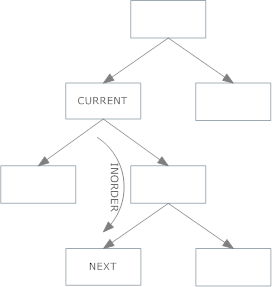
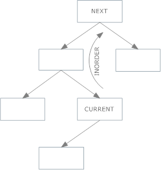

# Scheduling and Binary Search Trees (BST)

## Motivation: Runway Reservation System
* Airport with 1 runway
* Reservations for future landings set *R*
* Reserve request specifies landing time *t*
* Operations:
    * Add *t* to the set *R* if no other landings scheduled within *k* minutes
    * Remove from set *R* after plane lands
* Aim for operations to take O(logn) time
    * Where |R| = n

### Example
```
k = 3
current_time = 20
R = {41.2, 49, 56.3}

t = 53 -> OK
t = 44 -> NOT ALLOWED (too close to 41.2)
t = 20 -> NOT ALLOWED (in the past)
```

### Unsuitable Implementations
* Unsorted Array:
    * Insert is O(1) but requires check for valid time
    * Check takes **O(n)** as linear scan through entire array checking against k -> too slow
* Sorted Array:
    * Use binary search to find insertion point
        * Finds smallest i such that R[i] >= t
        * O(logn) time
    * Check against neighbouring elements to insertion point
        * Compare R[i] and R[i-1] against t
        * O(1) time
    * Insert item if check passes
        * Requires shifting elements
        * O(n) time
* Heaps (min or max)
    * Insert = O(logn) time
    * Check for element that is <=k or >=k from t is O(n) time

**Need fast insertion into a sorted list**

## Binary Search Tree
* Each node *x* has:
    * A key - key(*x*)
    * Parent pointer p(x)
        * Except **root** node
    * Left child pointer left(x)
    * Right child pointer right(x)

* BST Invariant:
    * For any node *x*, for all nodes *y* in the left subtree of *x*, key(y) <= key(x). For all nodes *y* in the right subtree of *x* key(y) >= key(x)

### insert(val) Operation

* Follow left and right pointers according to invariant property:
    * If val >= node:
        * Follow right pointer
    * If val <= node:
        * Follow left point

* Including a check (i.e runway scheduling problem) during insertion:
    * If an element on the path from the root does not pass the check, interrupt procedure and do not insert
Runway scheduling example:
```
k = 3
R = {49,46,41,79}
BST R:
        49
    46      79
41 

insert(42) into R:
42 <= 49 (follow left), 49-42 >= k proceed
42 <= 46 (follow left), 46-42 >= k proceed
42 >= 41 (follor right) 42-41 !>= 4 interrupt -> do not insert
```

* O(*h*) time
    * *h* = height of BST

### find_min(BST) and find_max(BST) Operations
* find_min() = follow left pointers until leaf
* find_max() = follow right pointers until leaf
* Both O(h)

### find(val) Operation
Find a value in BST if it exists
* Follow l/r pointers appropriately until val found or null/None is hit

### next_largest(node) Operation
Find the next largest node in the tree after a given node.
* If the node has a right child, find the minimum child of that node:
    * Move to the right child
    * Follow left pointers as far as possible
    * Return the node
    * Lowest valued node which is higher than the starting node.
    
* Else, traverse upwards following parent pointers until a parent is found with left child that is the current node - return the parent
    

### remove(val) operation
Remove a value from the tree, and return the root node
* Easiest way is to pass root: `remove(root, val)`
* Traverse tree to find node:
```Python
    if val < root.data:
        root.left = remove(root.left, val)
    # val in right subtree
    elif val > root.data:
        root.right = remove(root.right,val)
    else:
        # node found: proceed with remove algorithm
```
* Return if node is None -> base case
* If node has no children:
    * Set parent pointers to None
* If node has 1 child:
    * Link child node (with it's subtree) dierctly to the parent of the removed node
* If node has 2 children:
    * Find minimum value in the right subtree of the node
    * Replace **value** of the node to be removed with the found minimum value
        * Creates a **duplicate**
    * Apply remove to the duplicate in the right subtree to remove
        * i.e. `remove(duplicate_node, val)`
    * return root


### Traversal
3 types of (depth first) Traversal:
* In-order traversal:
    * Left subtree visited first, then the root and later the the right subtree
    * Produces sorted key values in an ascending order
    ```
    Until all nodes traversed:
        - Recursively traverse left subtree
        - Visit root node
        - Recursively traverse right subtree
    ```
* Pre-order traversal:
    * Root node visited first, then left subtree, lastly right subtree
    ```
    Until all nodes traversed:
        - Visit root node
        - Recursively traverse left subtree
        - Recursively traverse right subtree
    ```
* Post-order traversal:
    * Left subtree visited first, then right subtree, lastly visit root
    ```
    Until all nodes traversed:
        - Recursively traverse left subtree
        - Recursively traverse right subtree
        - Visit root node
    ```
## Runway Scheduling Additional Rank(t) Requirement
Rank(t): how many planes are scheduled to land at times <= t

Augment BST structure such that nodes track the size of their subtrees
* Update during insert/delete operations
    * Follow insertion/deletion path increment/decrement each node size
* O(h) time

Now find Rank(t):
* Walk down tree to find time *t*
    * Add in nodes that are smaller
    * Add in the subtree sizes to the left (must be less than *t*)
```
k = 3
R = {49,46,43,79,64,83}
BST R:
        49
    46      79
 43       64   83

Rank(79):
79 >= 49 (follow right) add 1 (49 < 79) 
add 2 (subtree 46 (size to the left) size)
79==79 add 1
add 1 (subtree 64 (size to the left) size)
total = 1+2+1+1 = 5
```
* **O(n)** still not solved!
    * If *h* = *n*, insertion is O(n)
    * Need **balanced BST**