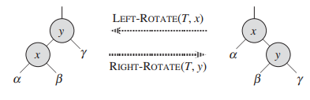
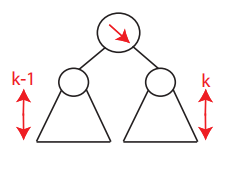
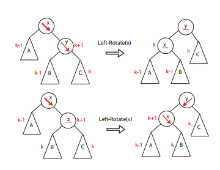
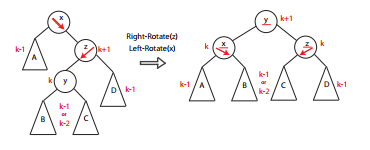

# Balanced Binary Search Trees
Height of BST = length of longest path from root down to leaf

Balanced BST maintains **h = O(logn)** -> operations run in O(logn) time
```
Perfectly Balanced height = O(logn):

    41    
   /  \    
  20   65 
 /\    / \ 
11 29 50  70

Path (unblanaced) height = O(n):
10
 \
  11
   \
    15
     \
      16
       \
       18
```

**Height of a node** = Longest path from node down to a leaf
* max(height(left child), height(right child)) + 1
* Store this using **data structure augmentation**

## BST Rotation
Change pointer structure through local operation which preserves the BST property

Left and Right rotate are symmetric




### Left Rotate (root goes to left)
* Rotate on a node x
* Assume right child y is not nil
* Pivots around the link from x->y 
    * Makes y the new subtree root
    * Makes x y's left child
    * Makes s'x left child y's right child

### Right Rotate (root goes to right)
* Rotate on a node y
* Assume right child x is not nil
* Pivots around the link from y->x
    * Makes x the new subtree root
    * Makes y x's right child
    * Makes x'x right child y's left child


## AVL Trees
Adel'son-Vel'skii & Landis 1962

* **nil** nodes/trees have height **-1**
    * Leaf node height = max(-1,-1) +1 = 0
* Require heights of left and right children of *each* node to differ by **at most ± 1**



### AVL Trees are **balanced**
* Worst Case: Right subtree has height 1 more than left for every node
    * N<sub>h</sub> = min # nodes in an AVL tree of height h
        * N<sub>h</sub>= N<sub>h-1</sub> + N<sub>h-2</sub> + 1
            * Height of node = height of left subtree + height of right subtree + 1 (node itself)
            * Left right subtree = h-1, left subtree = h-2 (differ by at most 1)
        * N<sub>h</sub> > 2N<sub>h-2</sub>
        * N<sub>h</sub> > 2<sup>h/2</sup>
        * h < 2log(N<sub>h</sub>)

### AVL Insert
1. Insert same as BST
2. Walk up tree restoring AVL property (updating heights)

Walk up tree updating heights to find lowest node x violating AVL property:
* assume x is **right-heavy**
* if x's right child is right heavy **or** balanced:
    * Left-Rotate(x) twice
    * 
* Else:
    * Right-Rotate(x.right-child)
    * Left-Rotate(x)
    * 
* Continue up to x's grandparent, greatgrandparent...

## AVL Sort
* Insert n items
    * O(nlogn)
* Do in-order traversal
    * O(n)

## ADT vs DS
* Abstract Data Type: interface specification
* Data Structure: specific algorithms for each operation

* Many possible DS's for one ADT

| Proiority Queue ADT   | Heap DS | AVL Tree DS   |
|:-----------------------:|:---------:|:---------------:|
| Q = new-empty-queue() |   θ(1)  |      θ(1)     |
|      Q.insert(x)      | θ(logn) |    θ(logn)    |
|   x = Q.deletemin()   | θ(logn) |    θ(logn)    |
|    x = Q.findmin()    |   θ(1)  | θ(logn)->θ(1) |

|        Predecessor/Successor ADT        | Heap DS |  AVL Tree DS  |
|:---------------------------------------:|:-------:|:-------------:|
|              S=new-empty()              |   θ(1)  |      θ(1)     |
|               S.insert(x)               | θ(logn) |    θ(logn)    |
|                S.delete()               | θ(logn) |    θ(logn)    |
| y = S.predecessor(x) -> next-smaller(x) |   θ(n)  | θ(logn)->θ(1) |
|   y = S.successor(x) -> next-larger(x)  |   θ(n)  | θ(logn)->θ(1) |