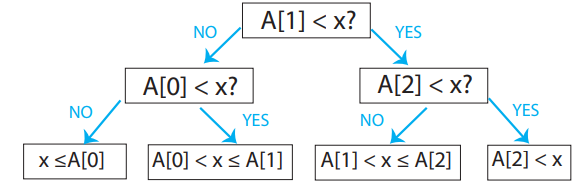
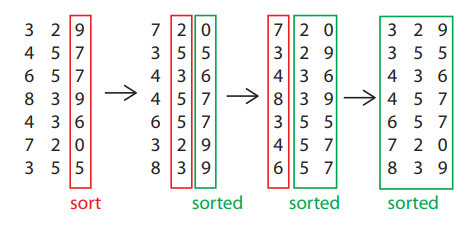

# Linear Time Sorting

## Comparison Model of Computation
* All input items are 'black boxes' (ADT's)
* Only operations allowed are **comparisons**
    * <,<=,>,>=,=
* Time cost = number of comparisons

## Decision Tree
Any *comparison* algo can be viewed as a tree for a particular *n* of all possible:
* Comparisons
* Outcomes of comparisons
* Resulting answer

| Decision Tree | Algorithm |
| :-------------: | :---------: |
| Internal node | Binary decision (comparison) |
| Leaf node | Found answer |
| Root->Leaf path | Algorithm execution |
| Path length   | Running time |
| Height of tree | Worst-case running time |

### Binary Search *n*=3



## Search Lower Bound (Comparison Model)
* *n* pre-processed items
* Finding a given item requires &Omega;(log(n)) in **worst case**

### Proof
* number of leaves >= number of possible answers >= *n*
    * Must have at least *n* leaves, one for each answer
* Decision tree is binary
* Therefore **height** >= log(n)
* Height = worst case running time

## Sorting Lower Bound
* *n* items
* Sorting requires &Omega;(nlog(n))

### Visualization
Internal nodes take the form:
```
    +-------------+
    | A[i] < A[j] |
    +-------------+
No /               \ Yes
  /                 \
```
Leaf nodes take the form of a 'sorted list':
```
+--------------------+
| A[5]<=A[7]<=A[3]...|
+--------------------+
```

### Proof
* number of leaves >= number of possible answers = ***n*!**
    * Worst case = all *n* items are distinct -> permutations of items = *n*!
* Decision tree is binary
* Therefore height >= log(n!):
    * = log(1 · 2 · · ·(n − 1) · n)
    * = log 1 + log 2 + · · · + log(n − 1) + log n
    * = &sum;<sup>n</sup><sub>i=1</sub> log i
    * \>= &sum;<sup>n</sup><sub>i=n/2</sub> log i
    * \>= &sum;<sup>n</sup><sub>i=n/2</sub> log n/2
        * log(n/2) = log(n-1)
    * = n/2&middot; logn - n/2 = &Omega;(nlog(n))

* OR via **Sterlings Formula** log(n!) = n log(n) - O(n):
    * n! ~ sqrt(2&pi;n)&middot;(n/e)<sup>n</sup>
    * &rarr; log(n!) ~ nlog(n) - (log(e))&middot;n + 1/2&middot; log(n) + 1/2 &middot; log(2&pi;)
        * O(n)

## Linear-time Sorting (Integer sorting)
* Assume *n* keys
* Keys are integers &isin; {}1,2,..., k-1
    * Must each fit into a *word*
    * If larger than a word, comparison is not O(1)
* Can do *more* than comparisons
* If k = *n*<sup>O(1)</sup> can **sort in O(n)** time
    * i.e k is not too big

### Counting Sort
Count occurences of each key using RAM output *count* copies of each key in order.

```
L = array of k empty lists # A
for j in range(n):                    #
    L[key(A[j])].append(A[j]) # B     # C
    # random access using integer key #
output = []             #
for i in range(k):      # D
    output.extend(L[i]) #
```
* A = O(k)
* B = O(1)
* C = O(n)
* D = O(&sum;<sub>i</sub>(1+|L[i]|)) = O(k+n)

**Time** = &theta;(n+k)
* Space complexity is same

### Radix Sort
* Imagine each integer in base *b*
    * &rarr; d = log<sub>*b*</sub>k digits &isin; {0,1,...,*b*-1}
* Sort (all *n* items) by **least significant** digit
    * Can extract digit in O(1) time
* Repeat increasing by 1 significant digit until:
* Sort (all *n* items) by **most significant** digit
* Sort **must be stable**
    * Preserve relative order of items with the same key
    * &rarr; don't mess up previous sorting



* Use counting sort for digit sort:
    * &rarr; &theta;(n+b) per digit
    * &rarr; &theta;((n+b)d) = &theta;((n+b)log<sub>b</sub>k) total time
    * **Minimized** when **b=n**
    * &rarr; &theta;(n log<sub>n</sub>k)
    * = O(n&middot;c) **if** k <= n<sup>c</sup>