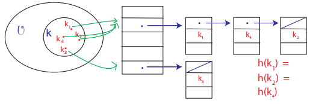
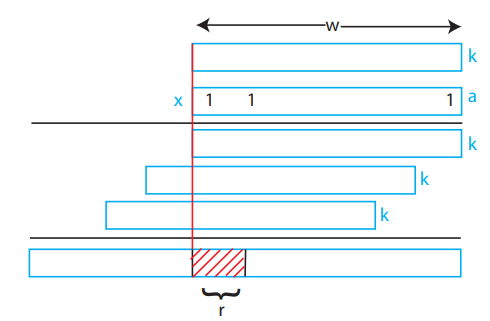

# Hashing 1

## Dictionary: Abstract Data Type
Maintain set of items, each with a **key**

Operations:
* insert(item)
    * items have **distinct keys**, overwriting if already in dictionary
* delete(item)
* search(key)

Balanced BST implementation is O(log(n)) per operation
**Goal = O(1)**

## Hashing Motivation
* Compilers/Interpreters: names -> variables
* Virtual memory: virtual address -> physical address
* Network routers: IP address -> wire
* Network server: port number -> socket/application
* Substring search: i.e. grep
* File/Directory sync: i.e. rsync
    * Tell whether file/dir has changed
* Cryptography: file transfer and identification
    * Checksums

## Direct Access Table (Simple Approach)
* Store items in array
* Index items by key
```
 +-------+
0| item0 |
 +-------+
1|       |
 +-------+
2| item2 |
 +-------+
3|       |
 +-------+
```
### Problems
1. Keys may not be non-negative integers
2. Large space requirement
    * Lots of space may be wasted

### Solution to 1: prehash
* Map keys to non-negative integers
* *Theoretically* possible because keys are finite and discrete
    * Everything *can* be represented by a string of bits
* In theory, x=y &hArr; hash(x) == hash(y)

### Solution to 2: hashing
* Reduce universe *U* of all keys (integers) to a reasonable size *m* for the hash table
* *m* &asymp; *n* = number of keys in the subset of *U* that are actually stored in dictionary
* hash function h: *U* &rarr; {0,1,...,m-1}
* **Collisions** can occur when h(k<sub>1</sub>)=h(k<sub>2</sub>) and k<sub>1</sub>!=k<sub>2</sub>
    * Two different keys hash to the same value

## Chaining
Method to deal with **collisions**

* Linked list of the colliding elements in each slot of the hash table



* Search must look through entire list
* Worst case: all *n* keys hash to same slot
    * &theta;(*n*) per operation

## Simple Uniform Hashing
**Uses a probabilistic assumption**: Each key is *equally* likely to be hashed to any slot of the table, independent of where other keys are hashed to.

### Analysis
* *n* keys stored in table
* *m* slots in table
* **Load factor &alpha;** = *n*/*m* = expected length of the chain

Running time = &theta;(1+&alpha;)
* 1 from applying hash function and random access to the slot
* &alpha; from searching the list

## Hash Functions

### Division Method
h(k) = k mod m

* Practical when m is **prime** *but* not too close to a power of 2 or 10
    * Inconvenient to find a prime number
* Division is slow

### Multiplication Method
h(k) = [(a&middot;k) mod 2<sup>w</sup>] >> (w-r)
* a is *random*
* *k* = *w* bits (word size)
* *m* = 2<sup>r</sup>



* Practical when:
    * a is odd
    * 2<sup>w-1</sup> < a < 2<sup>w</sup>
    * a not too clost to 2<sup>w-1</sup> or 2<sup>w</sup>
* Multiplication/bit extraction faster than division

### Universal Hashing
h(k) = [(a&middot;k+b) mod p] mod m
* a and b are *random* &isin; {0,1,...p-1}
* p is a lareg prime (>|*U*|)

* For worst case keys k<sub>1</sub>!=k<sub>2</sub>:
    * Pr<sub>a,b</sub>{event X<sub>k<sub>1</sub>,k<sub>2</sub></sub>} = Pr<sub>a,b</sub>{h(k<sub>1</sub>)=h(k<sub>2</sub>)} = 1/m
    * Probability of two distinct keys colliding = 1/m